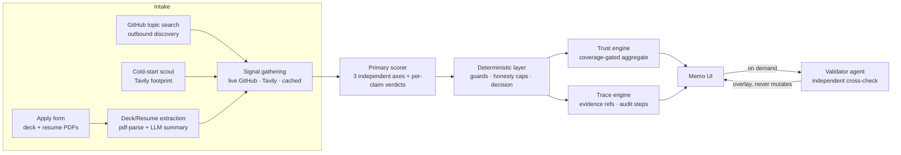
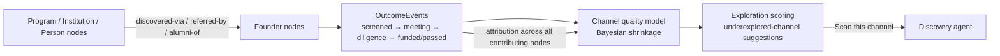

# VC Brain — Technical Architecture & Handoff

**Maschmeyer Group "The VC Brain" — Hack-Nation 6th Global AI Hackathon**
An evidence-first founder-screening engine: every recommendation traces to the exact data point that justified it, every claim is verified against live signals, and the system says "insufficient evidence" instead of inventing confidence.

---

## 1. System overview



One request path, four safety layers: extraction and signal gathering are fail-soft, scoring is retried with cross-provider fallback, the deterministic layer enforces honesty rules the model cannot override, and the validator overlays an independent second opinion.

## 2. Design principles (encoded from prior failures)

| Principle | Implementation |
|---|---|
| **Deploy green first** | `next build` + `/api/health` gate every feature; no red-build development |
| **No database** | All state in one in-memory store (`globalThis`, hot-reload-safe, self-healing schema). A judge sees one session; deploy risk deleted |
| **One LLM swap point** | `src/lib/llm.ts` is the only file that talks to a provider. Retry ×3 with jittered backoff → automatic OpenAI→Anthropic fallback |
| **Axes never averaged** | Founder / Market / Idea-vs-Market are scored, stored, and rendered independently — always |
| **Trust is per claim** | Every claim carries status + confidence + evidence + source. The founder-level aggregate is derived and coverage-gated, never a replacement |
| **Honesty over confidence** | No independent evidence → no trust number, plus an unlock list. Thin evidence → capped confidence, wide bands. Cold-start founder reads 64 ±14, not a fake-precise 78 |
| **Fail-soft by contract** | Every external call (GitHub, Tavily, LLM, PDF parse) has a timeout and a degradation path. A provider outage degrades the answer; it never breaks the pipeline |

## 3. Pipeline walkthrough

**Intake.** `/api/apply` accepts JSON or multipart (deck + resume PDFs, 15 MB store cap). `pdf-parse` (5s cap, lazy-loaded) extracts text; a reasoning-tier LLM produces a structured executive summary — deck: snapshot / claims / market / traction / metrics; resume: roles / education / background claims, with a strict career-signal-only privacy rule plus deterministic email stripping. Extracted claims *become* the claims the Trust Score verifies. Originals are stored and served back via `/api/document`.

**Signal gathering.** Founders with a GitHub URL get live repo signals (stars, forks, last-commit recency, 3s timeout, 60→5000 req/hr with token). Cold-start founders get a Tavily public-footprint search. Failures fall back to cached signals, explicitly marked stale — and stale evidence caps claim confidence at 0.7 in code.

**Primary scoring** (`src/agents/score.ts`). One reasoning-model call scores three independent axes (verdict + trend + rationale each) and issues per-claim verdicts (verified / contradicted / unverifiable) against the gathered signals. Deck and resume summaries enter the prompt as *the founder's own narrative* — signals outrank them on conflict.

**Deterministic layer.** Everything the model can get wrong is corrected in code: sanitization and clamping of model output; a contradiction guard for known-false claims; thin-evidence rules (no submitted claims → nothing can be "contradicted", confidence capped at 0.6, high conviction mathematically unreachable); recommendation / conviction / check size / flags derived from axes + contradiction count — never left to the model.

**Trust engine** (`src/lib/trust.ts`). Founder-level aggregate with three non-negotiables: *contradiction asymmetry* (one caught lie caps trust at 40 regardless of verified claims), *coverage gating* (zero independent evidence channels → `score: null`, "insufficient evidence", and an unlock list telling the founder exactly what to submit), and *thin-evidence caps* (footprint observations max out at caution, band ≥ 12).

**Trace engine** (`src/lib/trace.ts`). Every scoring run emits a structured decision trace — typed evidence refs with IDs assigned at creation, per-step audit records (agent, action, conclusion, status, duration), and post-hoc claim citations matched by conservative text overlap. Uncited claims are flagged, never faked. No prompts or chain-of-thought are ever exposed — evidence and conclusions only.

**Validator agent** (`src/agents/validate.ts`). On demand, gathers *fresh* independent evidence (its own GitHub re-fetch + Tavily searches, labeled "web evidence, best-effort") and runs a second model pass, then a **deterministic adjudicator** enforces: downgrade-only (an upgrade-capable hallucination checker is a hallucination injector), no verdict change without attached evidence, wrong-entity evidence never verifies. The cached assessment is never mutated — validation is an overlay with recomputed trust-after. In live testing the validator caught real similarly-named companies (Reflection AI, Reflex.dev) and refused to use them as evidence.

## 4. Module map

```
src/agents/          score.ts       scoring pipeline + deterministic layers
                     deck.ts        deck/resume extraction + summaries (PII-guarded)
                     github.ts      live repo signals + user profiles (fail-soft)
                     coldstart.ts   Tavily search (footprint + generic)
                     discover.ts    outbound discovery: topic search → scored founders
                     validate.ts    validator agent + adjudicator
src/lib/             llm.ts         THE provider swap point: retry, jitter, fallback
                     models.ts      model routing config (reasoning/volume tiers)
                     store.ts       in-memory store (self-healing, hot-reload-safe)
                     types.ts       frozen domain types
                     trust.ts       trust aggregate engine
                     trace.ts       evidence refs + decision-trace collector
                     thesis.ts      thesis-lens fit scoring + re-ranking
                     sourcing.ts    provenance + channel quality stats
src/app/api/         health · score · rank · apply · discover · deck · resume
                     document · trace · validate · sourcing
```

Ownership during the build: **Builder Alpha** owned `src/agents`, `src/lib`, `src/app/api`; **Builder Beta (Codex)** owned `src/components` and pages. Contracts were frozen in writing before parallel work; integration was a field-swap, not a merge.

## 5. The three judged functions

**Agentic traceability — shipped.** Citation chips on every axis rationale, claim, and recommendation open the exact evidence excerpt (deck claim, GitHub signal, web snippet) with source badge and link. A collapsed-by-default audit trail shows every pipeline step with status (supported / corrected / challenged / insufficient). Maya's "10,000 active users" citation opens the dormant-repo evidence that contradicted it.

**Self-correction loop — shipped.** Validator agent as above: independent evidence, downgrade-only adjudication, wrong-entity guard, honest "Not independently validated" badge when checks are unavailable, original-vs-revised deltas in the audit trail.

**Sourcing & network intelligence — shipped (lite) + designed (full).** Live now: per-founder provenance chains ("GitHub topic: llm-inference → repo: ray-project/ray") and `/api/sourcing` channel stats ranked by *quality* — mean trust, invest rate, contradiction rate — with explicit small-sample caveats, never by volume. The full graph model is the committed follow-up (§6).

## 6. Follow-up: full Sourcing & Network Intelligence

The extended design (agreed between both builders, contracts drafted):



- **Graph model:** `SourceNode` (channel / program / institution / person / founder), `SourceEdge` (discovered-via, referred-by, alumni-of, member-of), `OutcomeEvent` (stage transitions with trust score and check size at time of event).
- **Channel quality:** funded-rate, diligence-rate, median trust, median evidence coverage, per-axis outcomes, and time-to-decision — with **Bayesian shrinkage** so one lucky founder doesn't outrank twenty consistently strong ones.
- **Feedback loop:** "Mark funded" writes an `OutcomeEvent`, credits *every* contributing source node (even-split attribution first, weighted later — never 100% to the last touch), recomputes quality, and visibly reorders channel recommendations.
- **Exploration scoring:** historical quality × confidence-adjusted conversion × low current coverage × similarity to proven programs, with a small-sample exploration bonus — surfacing e.g. *"ETH AI Center: 2 founders scanned, adjacent programs produced 4 high-trust opportunities — run a targeted scan"*, wired directly into the existing discovery agent.
- **Honest limitation:** the in-memory architecture learns within a session. Production requires an append-only event store to learn across deployments — a deliberate hackathon trade (deploy risk was the #1 historical failure mode), with a clean seam: `OutcomeEvent` is already append-only in shape.

Estimated effort: ~2h backend (graph + shrinkage + outcome endpoint), ~2–3h UI (sourcing workspace), independently shippable.

## 7. Resilience inventory

| Failure | Behavior |
|---|---|
| OpenAI transient error (observed under parallel load) | 3 attempts, exponential backoff + jitter → Anthropic fallback → deterministic stub, *never cached* |
| GitHub down / rate-limited / repo 404 | 3s timeout → cached signals marked stale → confidence capped 0.7 |
| Tavily down / no key | seeded footprint with stale note, wide bands |
| Corrupt / oversized / image-only PDF | "deck not parsed" placeholder, pipeline continues |
| Validator failure | primary result kept, "Not independently validated" badge |
| Store schema drift across hot reloads | self-healing `getStore()` backfills missing fields |
| Stub assessment (total LLM outage) | served once, never cached, `null` to clients so they retry — a poisoned cache can't survive |

## 8. Runbook

- **Env:** `OPENAI_API_KEY`, `OPENAI_REASONING_MODEL`, `OPENAI_VOLUME_MODEL`, `TAVILY_API_KEY`, `GITHUB_TOKEN` (optional, 5000 req/hr), `ANTHROPIC_API_KEY` (optional, enables provider fallback), `MODEL_BACKEND=openai`. Set in `.env.local` and Vercel.
- **Deploy:** push to `main` → Vercel auto-deploy → verify `/api/health` returns `{ok:true}`. Uploads on Vercel are capped ~4.5 MB by the platform (client enforces 4 MB).
- **Demo flow:** Founder view → apply as Maya (deck + resume) → VC view → ranked pipeline → Maya's memo → "10,000 active users" flagged red → citation opens dormant-repo evidence → **Validate screen** → wrong-entity catch → audit trail → Tomas's memo for honest cold-start (64 ±14) → thesis re-rank → sourcing provenance.
